# Pepa Sensory Arm Installation - Quick Start

> **Applies to:** PSA v0.1.x · Last verified against a fresh installation on 2026-07-17

## Overview

Pepa Sensory Arm is a Home Assistant custom component - an AI agent that performs the sensory and memory collection functions of Pepa, the aging-in-place system described in [ai4aging.org](https://ai4aging.org). It brings advanced conversational AI capabilities with tool execution, context injection, and intelligent automation management. Works with OpenAI, Ollama, LocalAI, and any OpenAI-compatible endpoint.

Cloud endpoints are a fine way to learn. Pepa's mission, however, is local-first — see the [Manifesto](https://ai4aging.org/general/manifesto) for why your household's words should stay in the house.

**Already running Anton Radlein's Home Agent?** Keep it. Pepa Sensory Arm is built upon it, and the two coexist as separate conversation agents. Leaving Home Agent in place gives you a known-good control: when a Pepa Sensory Arm response surprises you, ask Home Agent the same question and you'll know immediately whether the issue is in Pepa or in your setup.

## Prerequisites

Install these **before** Pepa Sensory Arm. Doing so keeps setup to a single pass.

1. **Home Assistant 2026.1.0 or later**
2. **HACS** installed and working
3. **Pyscript integration** — a hard dependency; Pepa Sensory Arm will not start without it.
   - Install via HACS (instructions: https://github.com/custom-components/pyscript)
   - When adding the Pyscript integration, **enable all three configuration checkboxes, including "hass is global"**. Pepa's perception scripts will not load without them.

   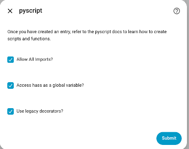
4. 
5. **Network access** to your chosen LLM endpoint (cloud or local)
5. *Optional:* **ChromaDB server** — required for vector search and memory features (see [VECTOR_DB_SETUP.md](VECTOR_DB_SETUP.md))

## HACS Installation (Custom Repository) — Recommended

Pepa Sensory Arm is not yet listed in the default HACS store, but it installs cleanly as a custom repository:

1. Open **HACS** in the sidebar
2. Open the three-dot menu (top right) and select **Custom repositories**
3. Enter:
   - **Repository:** `https://github.com/prsws/pepa-sensory-arm`
   - **Type:** `Integration`
   
   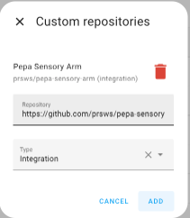


4. Click **Add**. HACS registers the repository.
5. Close the dialog using the **"X"** — **do not click Cancel**, which discards the registration you just made

   

6. In HACS, search for **Pepa Sensory Arm** and open it

   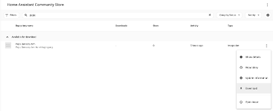

7. Click **Download** and accept the latest version

   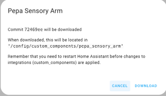

8. **Restart Home Assistant** when prompted (the prompt's appearance varies with download method; if none appears, restart via **Settings > System > Restart**)

   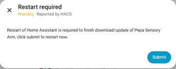

## Manual Installation (Fallback)

1. **Clone or download** the repository:
   ```bash
   cd /config
   git clone https://github.com/prsws/pepa-sensory-arm.git
   ```

2. **Copy to custom components**:
   ```bash
   cp -r pepa-sensory-arm/custom_components/pepa_sensory_arm /config/custom_components/
   ```

3. **Verify files are in place**:
   ```bash
   ls -la /config/custom_components/pepa_sensory_arm/
   ```

4. **Restart Home Assistant** via Settings > System > Restart

Note: manual installs do not receive HACS update notifications. Prefer the custom-repository method above.

## Add the Integration

1. Navigate to **Settings** > **Devices & Services**
2. Click **+ Add Integration** and search for **Pepa Sensory Arm**

   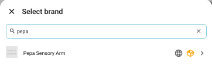

3. Setup begins. Two paths from here:

**If Pyscript is installed and configured (you followed Prerequisites):** setup pauses once to deploy the perception scripts — see the Repair flow below.

**If Pyscript is missing:** setup stops with an error. Install Pyscript per Prerequisites step 3 (all three checkboxes), then start the Pepa Sensory Arm setup again from **+ Add Integration**.

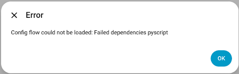

### First-time deployment (Repair flow)

Pepa Sensory Arm's default system prompt reads its device catalog from `sensor.pepa_entity_context`, published by three pyscript scripts bundled inside the integration: `entity_context.py`, `entities_list.py`, and `pepa_behavioral_capture.py`. The integration deploys and maintains these scripts itself.

On a fresh install the bundled scripts are not yet in your `<config>/pyscript/` folder, so setup raises a fixable issue under **Settings > System > Repairs** titled **"Pepa perception scripts are not installed"**:

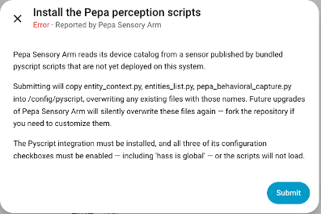

1. Click **Fix** and confirm. The three scripts are copied into `<config>/pyscript/` (the folder is created if needed) and Pyscript auto-loads them.
2. **Known issue (v0.1.x):** after the fix, an error dialog may appear. Click **Ignore** — it is cosmetic and setup completes normally behind it.

   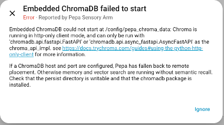
3. This Repair occurs **only once**, during initial installation. Updates redeploy the scripts silently.

If setup still reports the entity-context sensor as missing after the fix, re-check the three Pyscript configuration checkboxes.

> ### ⚠️ Your edits to the perception scripts WILL be lost
>
> On every startup, deployed scripts that differ from the bundled versions are **silently overwritten** with the shipped copies. There is no protection for local edits. If you need to customize `entity_context.py`, `entities_list.py`, or `pepa_behavioral_capture.py`, **fork the repository** — do not edit them in place.

### Uninstall

Removing the last Pepa Sensory Arm config entry deletes the three deployed scripts from `<config>/pyscript/`. Nothing else in that folder is touched.

## Initial Configuration

### Configure the primary LLM


| Field | Example Value |
|-------|---------------|
| Name | `Pepa Sensory Arm` |
| LLM Base URL | `https://api.openai.com/v1` (OpenAI) or `http://localhost:11434/v1` (Ollama) |
| API Key | Your API key (or leave blank for local models) |
| Model | `gpt-4o-mini` (OpenAI) or `llama3.2:3b` (Ollama) |
| Temperature | `0.7` |
| Max Tokens | `500` |

### LLM Provider Examples

**OpenAI:**
- Base URL: `https://api.openai.com/v1`
- API Key: Your OpenAI API key (sk-...)
- Model: `gpt-4o-mini` or `gpt-4o`

**Ollama (Local):**
- Install Ollama: `https://ollama.ai/download`
- Pull model: `ollama pull llama3.2:3b`
- Base URL: `http://localhost:11434/v1`
- API Key: Leave blank
- Model: `llama3.2:3b`

**For complete setup guides with ready-to-copy configurations, see [Example Configurations](EXAMPLE_CONFIGS.md)**

Other providers (LocalAI, LM Studio) follow similar patterns - see reference docs for details.

## Basic Setup

### Configure Context Mode

1. Go to **Settings** > **Devices & Services** > **Pepa Sensory Arm** > **Configure**
2. Select **Context Settings**
3. Choose your mode:

**Direct Mode (Simple):**
- Specify entities to always include
- Enter comma-separated entity IDs:
  ```
  climate.*,sensor.temperature_*,light.bedroom
  ```
- Good for small setups or specific use cases

**Vector DB Mode (Advanced):**
- Requires ChromaDB server (see [VECTOR_DB_SETUP.md](VECTOR_DB_SETUP.md))
- Automatically finds relevant entities via semantic search
- **Required for memory features**
- Better for large setups

> **⚠️ Choose your mode before enabling memory features.** In v0.1.x, switching from Vector DB mode to Direct mode after memory is enabled **silently disables vector memory search** — memory appears configured but returns nothing. This is a known issue. If you must switch modes, verify memory recall afterward with a Quick Test.

### Enable Conversation History

1. Navigate to **Configure** > **History Settings**
2. Configure:
   - **Enable History**: On
   - **Max Messages**: `10`
   - **Max Tokens**: `4000`

## Quick Test

Test your installation:

1. Open **Developer Tools** > **Services**
2. Select `pepa_sensory_arm.process`
3. Enter:
   ```yaml
   text: "What is the current temperature?"
   ```
4. Verify you receive a response

Test control:
```yaml
text: "Turn on the living room lights"
```

## Voice Assistant

1. Navigate to **Settings** > **Voice Assistants**
2. Create or edit an assistant and select **Pepa Sensory Arm** as the conversation agent
3. Expose the entities you want it to control via **Expose Entities**
4. Test by voice or via the Assist dialog. Bingo!

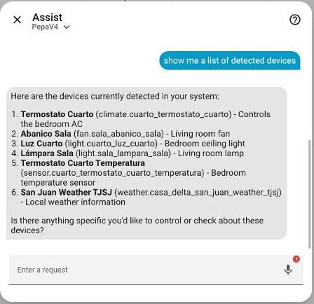

## Updating Pepa Sensory Arm

1. **Confirm your current version:** HACS > Pepa Sensory Arm
2. In HACS, open the Pepa repo's three-dot menu and select **Update Information** to force a refresh. Within moments a notification badge appears in the sidebar and the repo shows **Pending Update**

   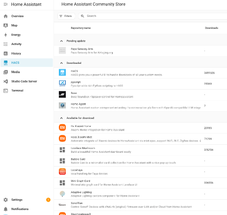

3. Go to **Settings** and start the update; click **Update**

   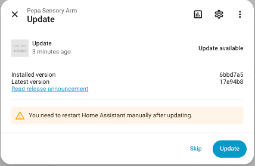

4. Once updated, click **Submit** and **restart Home Assistant**
5. After restart, confirm the new version in HACS and re-run the Quick Test

   

**Reminder:** every update silently redeploys the bundled perception scripts, overwriting any local edits (see warning above).

## Troubleshooting

**Connection Errors:**
- Verify base URL is correct and accessible
- For local models, ensure server is running (e.g., `ollama list`)
- Check firewall rules

**Authentication Errors:**
- Verify API key is correct
- Ensure billing is enabled (for paid services)
- For local models, try leaving API key blank

**Model Not Found:**
- For Ollama: `ollama list` to see available models
- Verify model name spelling

**Entity Not Found:**
- Check entity IDs in Home Assistant
- Expose entities via **Settings** > **Voice Assistants** > **Expose Entities**

**Setup fails with "Pyscript not found":**
- Install Pyscript via HACS and enable all three configuration checkboxes (including "hass is global"), then restart the Pepa Sensory Arm setup

**Error dialog after the Repair fix:**
- Known cosmetic issue in v0.1.x — click **Ignore**. If setup does not complete, re-check the Pyscript checkboxes

**Memory returns nothing after changing Context Mode:**
- Known issue in v0.1.x — switching Vector DB → Direct disables vector memory search. Switch back to Vector DB mode and verify ChromaDB connectivity

## Next Steps

1. **Advanced Features:**
   - [Vector DB Setup](VECTOR_DB_SETUP.md) - Enable semantic entity search
   - [Memory System](MEMORY_SYSTEM.md) - Add long-term memory capabilities

2. **Use in Automations:**
   ```yaml
   automation:
     - alias: "Morning Briefing"
       trigger:
         - platform: time
           at: "07:00:00"
       action:
         - service: pepa_sensory_arm.process
           data:
             text: "Give me a morning briefing"
   ```

3. **Monitor Performance:**
   - Enable debug logging in **Configure** > **Debug Settings**
   - Check logs for detailed execution info
   - Monitor events in **Developer Tools** > **Events**

## Need More Details?

See the [Complete Installation Reference](reference/INSTALLATION.md) for:
- Detailed configuration options
- All LLM provider examples
- Advanced troubleshooting
- Custom tool setup
- Performance optimization